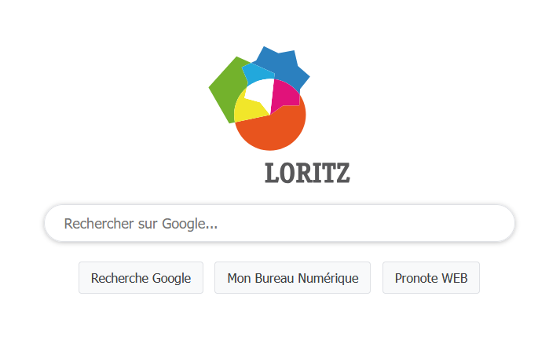

# Loritz Search Page

Page de recherche par défaut des navigateurs au [lycée Henri Loritz](https://www.loritz.fr).

Disponible à l'adresse https://search.loritz.fr , cette page est une simple page HTML avec un formulaire qui redirige les recherches vers https://www.google.com/search .

Des boutons ont été ajoutés pour accéder rapidement à Pronote et MBN.

## Evolution prévue

Il est prévu de permettre de diffuser des informations via cette page.